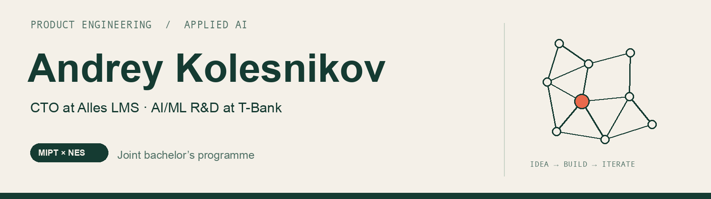
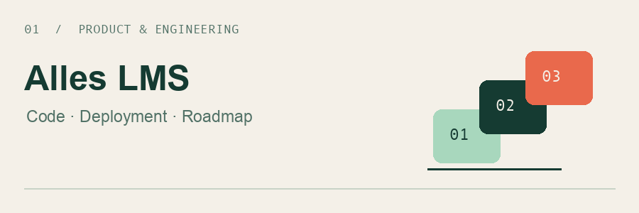
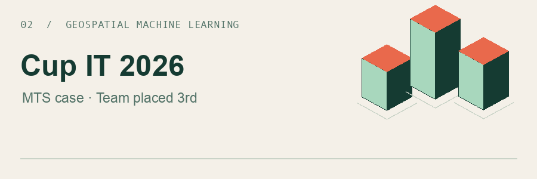
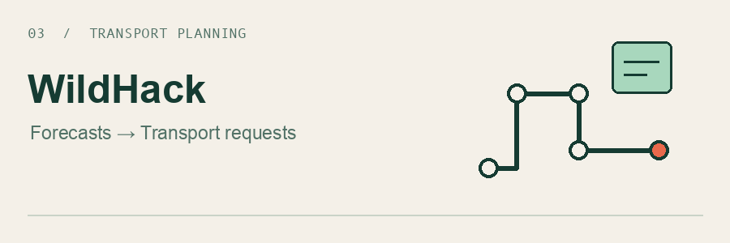
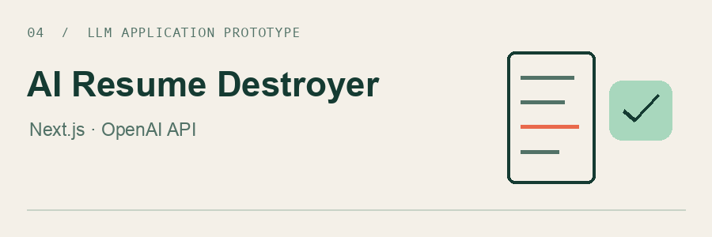

I build software products, work on applied AI/ML, and help run the MIPT Business Club.

[LinkedIn ↗](https://www.linkedin.com/in/andrei-kolesnikov-mipt/) &nbsp; · &nbsp; [Geoanalytics case ↗](https://github.com/SilenceOW/cupit2026final-geoanalytics-pipeline) &nbsp; · &nbsp; [MIPT Business Club ↗](https://t.me/miptbusinessclub)

## Selected work

<table>
<tr>
<td width="50%" valign="top">

<h3>Alles LMS</h3>

<b>CTO · Product &amp; engineering</b>

Built and deployed the full platform. I own updates, product discovery, feature priorities, the roadmap, and the change-request process.

</td>
<td width="50%" valign="top">

<h3>Geospatial ML</h3>

<b>Data Scientist / ML Engineer</b> Team placed 3rd in the Cup IT 2026 final.

For the MTS case: a Saint Petersburg building-height dataset built through data cleaning, matching, prediction, and validation.

<a href="https://github.com/SilenceOW/cupit2026final-geoanalytics-pipeline">Pipeline ↗</a> &nbsp; · &nbsp; <a href="https://github.com/SilenceOW/cupit2026final-geoanalytics-visualization">Web visualization ↗</a>

</td>
</tr>
<tr>
<td width="50%" valign="top">

<h3>Warehouse transport planning</h3>

<b>WildHack · Team prototype</b>

Shipment forecasts, transport requests, and dispatcher workflows. Built with FastAPI, React, and PostgreSQL.

<a href="https://github.com/SilenceOW/wildhack-web">Repository ↗</a>

</td>
<td width="50%" valign="top">

<h3>AI Resume Destroyer</h3>

<b>Next.js · OpenAI API · Small prototype</b>

An experiment in AI-generated resume feedback.

<a href="https://github.com/SilenceOW/AIResumeDestroyer">Repository ↗</a>

</td>
</tr>
</table>

## Beyond the repositories

**T-Bank · AI/ML R&D**  
I work on an AI adoption strategy for partner acquisition and two AI/ML projects moving through pilot evaluation, refinement, and scaling, as part of the MiniCEO leadership programme.

**MIPT × New Economic School (NES) · Joint bachelor's programme, 2024–2028**  
Applied Mathematics and Informatics, with a focus on data analysis in economics.

**MIPT Business Club · Organising team**  
Technical operations, recruiting the organising team, events, and resident selection. The club has **2,300+ public-channel subscribers** and a resident community of **30 entrepreneurs** whose companies average around **RUB 40 million in annual revenue**.
